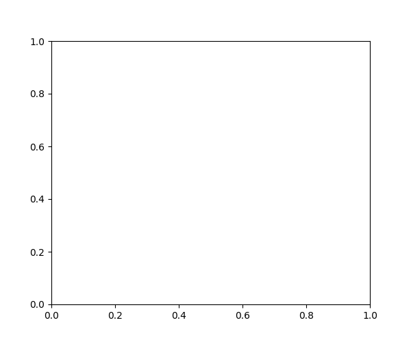
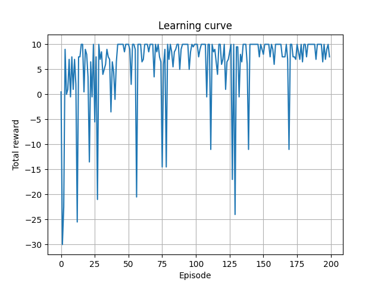
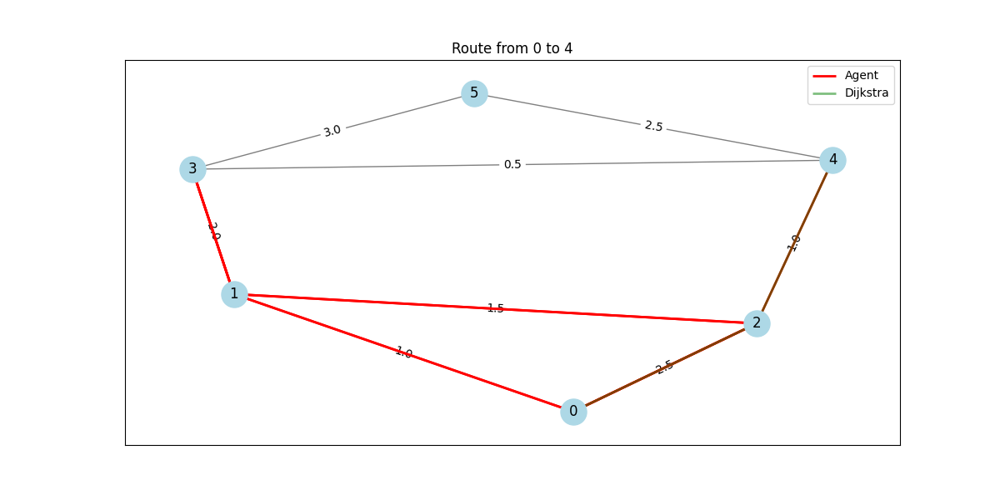
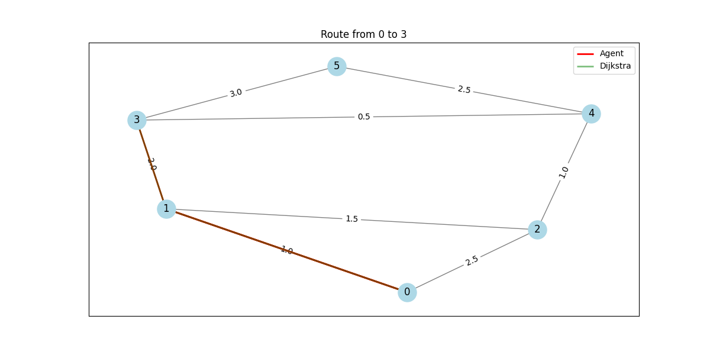
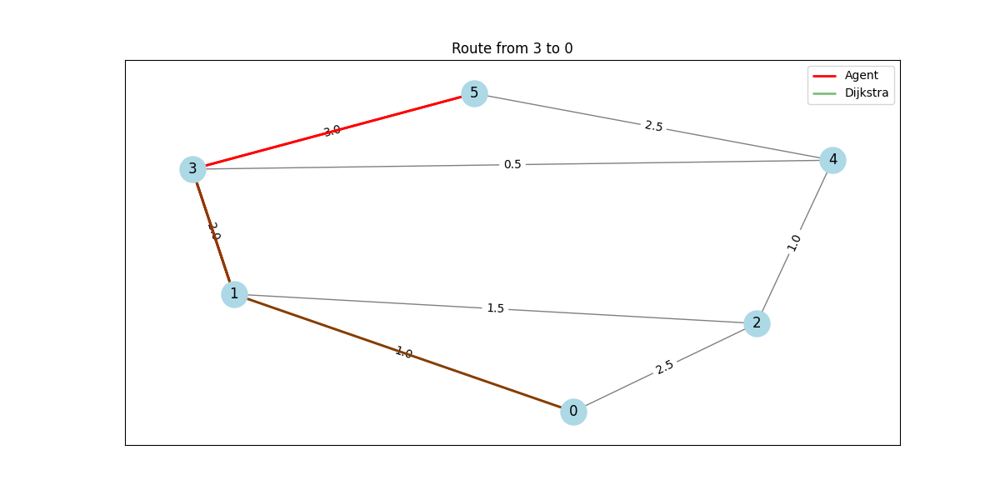

# Packet Routing with Reinforcement Learning

An interactive GUI application demonstrating Deep Q-Learning (DQN) for packet routing on network topologies. The agent learns to find efficient routes between nodes, competing with traditional algorithms like Dijkstra's shortest path.



## Features

### Interactive Training and Visualization
- Real-time visualization of the training process
- Training control panel with pause/resume/stop/restart capabilities
- Live display of training metrics (rewards, epsilon)
- Customizable training parameters (episodes, save directory, random seed)
- Visual feedback with color-coded nodes and path highlighting

### Network Management
- Custom network size and density configuration
- Dynamic network topology generation
- Edge weight visualization
- Automatic layout optimization
- Ensures connected networks (no isolated nodes)

### Analysis and Comparison
- Direct comparison between RL agent and Dijkstra's algorithm
- Side-by-side path visualization
- Cost comparison and analysis
- Performance evaluation over multiple trials
- Learning curve visualization



### Route Comparison Examples
| From 0 to 4 | From 0 to 3 | From 3 to 0 |
|-------------|-------------|-------------|
|  |  |  |

## Project Structure
- `src/env.py` - Network routing environment implementation
- `src/agent.py` - DQN agent with experience replay
- `train_dqn_tf.py` - Training script for the DQN model
- `gui.py` - Interactive visualization and control interface
- `evaluate.py` - Evaluation and comparison tools
- `tests/test_env.py` - Environment unit tests
- `requirements.txt` - Project dependencies

## Quick Start

```powershell
# Create and activate virtual environment
python -m venv .venv
.\.venv\Scripts\Activate.ps1

# Install dependencies
pip install -r requirements.txt

# Launch the GUI
python gui.py
```

## Using the GUI

1. **Training**:
   - Set training parameters (episodes, save dir, seed)
   - Use "Train" for background training or "Live Train" for visualization
   - Control training with pause/resume/stop/restart
   - Watch real-time progress in the log window

2. **Network Configuration**:
   - Adjust number of routers and network density
   - Click "New Network" to generate a new topology
   - Edge weights are randomly assigned between 1-10

3. **Testing and Comparison**:
   - Set source and destination nodes
   - Use "Simulate" to watch the agent navigate
   - Use "Compare with Dijkstra" to evaluate against optimal paths
   - View detailed statistics in the log window

## Technical Notes
- Uses TensorFlow (CPU) for the DQN implementation
- NetworkX for graph operations and visualization
- Matplotlib for embedded plotting
- Tkinter for the GUI framework

## Performance
The RL agent typically achieves near-optimal performance after sufficient training:
- Often finds optimal paths matching Dijkstra's algorithm
- Learns to avoid congested or high-cost routes
- Adapts to different network topologies

## Development Notes
- The project uses `.gitignore` to exclude cache files and virtual environments
- Python 3.8+ recommended
- All configuration is available through the GUI interface
